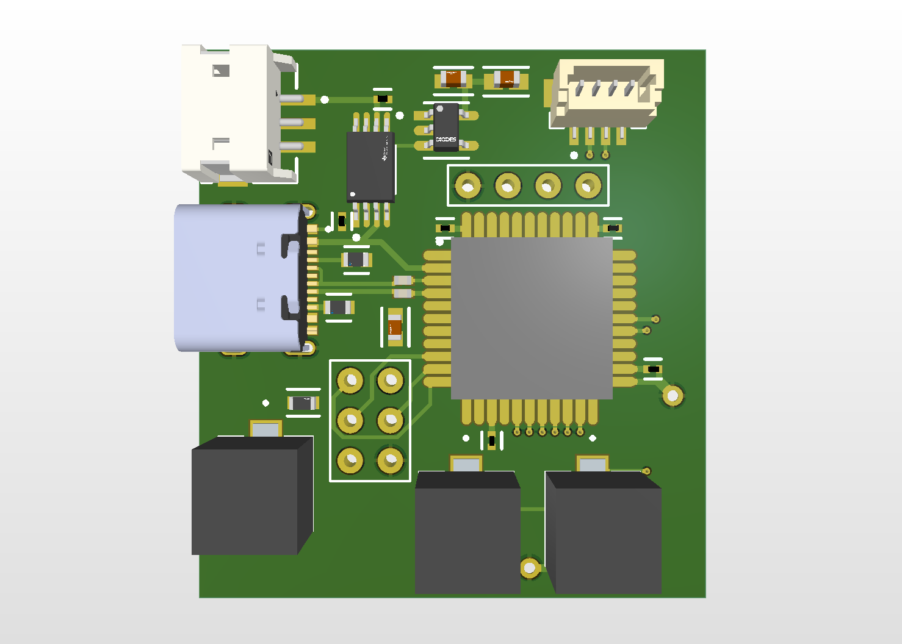

# walktimizer

A project inspired from a fact from a Physics for the Birds video about why humans like music or something. A general simplification of the the mechanics of walking is that of the inverted pendulum. From many introductory physics classes, we learn about the resonant frequency of pendulums. Combining this with my enjoyment of going outside and walking, I thought it would be fun to make a device that tracks optimal walking pace based on the length of our pendulum modelled legs. Additionally, I haven't had the chance to make many silly or just for fun projects in school, part of this is to scratch that itch.

A v1 PCB was designed, but I didn't like it so I never ended up ordering it. A v2 is now in progress, which will expand on the features and quality of the first design. Rather than reusing Arduino code and microprocessors, I will be using STM32 so I can learn how to design and program it.